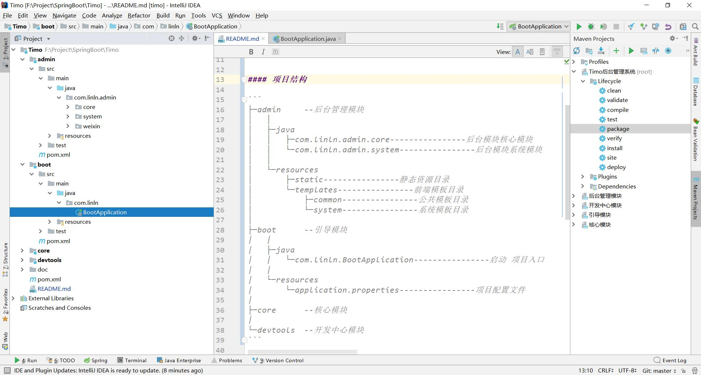
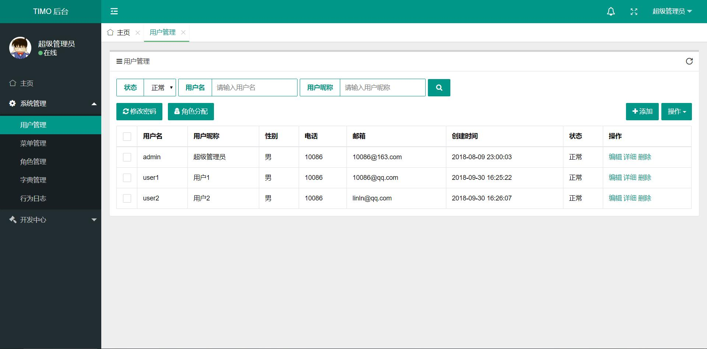
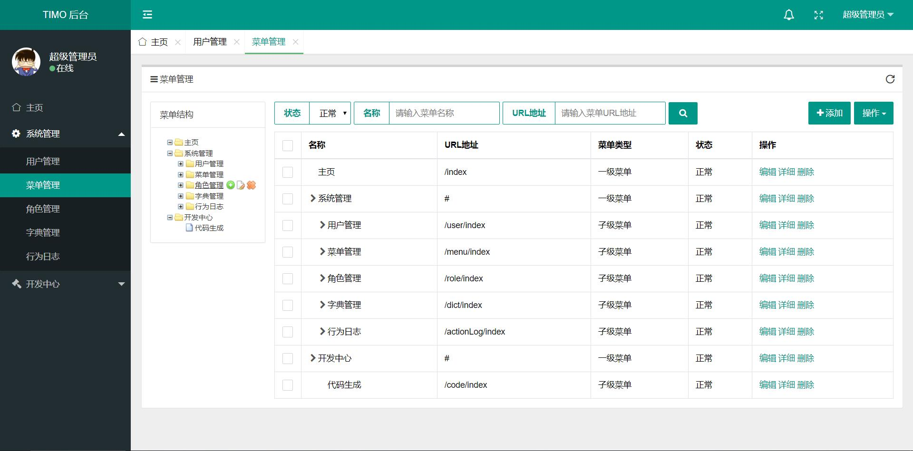
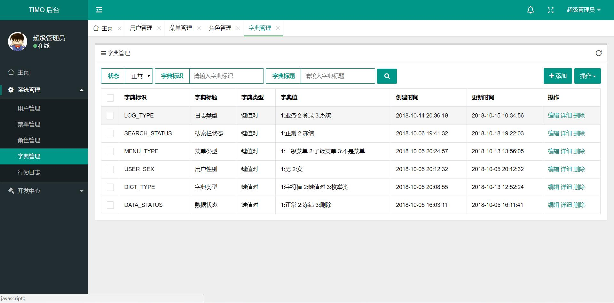
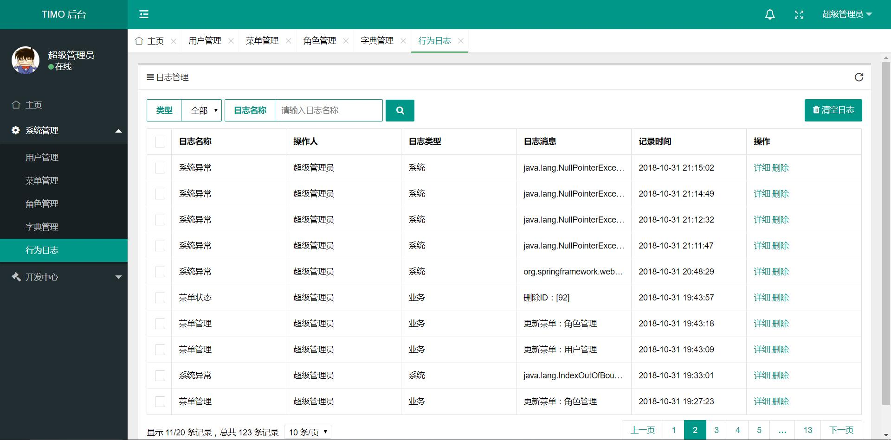
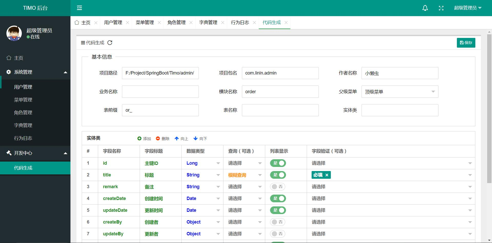

# Timo

[](LICENSE)
[](https://jq.qq.com/?_wv=1027&k=5RCnDCO)
[](https://gitee.com/aun/Timo/stargazers)
[](https://gitee.com/aun/Timo/members)
#### 项目介绍

TIMO后台管理系统，基于SpringBoot2.0 + Spring Data Jpa + Thymeleaf + Shiro 开发的后台管理系统，采用分模块的方式便于开发和维护，目前支持的功能有：权限管理、部门管理、字典管理、日志记录、文件上传、代码生成等，为快速开发后台系统而生的脚手架！

> 自我推荐-求工作：有意向的可以到群里联系我！

#### 技术选型

- 后端技术：SpringBoot + Spring Data Jpa + Thymeleaf + Shiro + EhCache

- 前端技术：Layui + Jquery  + zTree + Font-awesome

#### 项目结构

```
├─admin		--后台管理模块
│	│
│	├─java
│	│	├─com.linln.admin.core----------------后台模块核心模块
│	│	└─com.linln.admin.system----------------后台模块系统模块
│	│	
│	└─resources
│		├─static----------------静态资源目录
│		└─templates----------------前端模板目录
│			├─common----------------公共模板目录
│			└─system----------------系统模板目录
│
├─boot		--引导模块
│	│
│	├─java
│	│	└─com.linln.BootApplication----------------启动项目入口
│	│
│	└─resources
│		└─application.yml--------------------------项目配置文件
│	
├─core		--核心模块
│	
└─devtools	--开发中心模块
```

#### 功能列表

- 用户管理：用于管理后台系统的用户，可进行增删改查等操作。
- 角色管理：分配权限的最小单元，通过角色给用户分配权限。
- 菜单管理：用于配置系统菜单，同时也作为权限资源。
- 部门管理：通过不同的部门来管理和区分用户。
- 字典管理：对一些需要转换的数据进行统一管理，如：男、女等。
- 行为日志：用于记录用户对系统的操作，同时监视系统运行时发生的错误。
- 文件上传：内置了文件上传接口，方便开发者使用文件上传功能。
- 代码生成：可以帮助开发者快速开发项目，减少不必要的重复操作，花更多精力注重业务实现。
- 表单构建：通过拖拽的方式快速构建一个表单模块。
- 数据接口：根据业务代码自动生成相关的api接口文档

#### 安装教程

- ##### 环境及插件要求

   - Jdk8+
   - Mysql5.5+
   - Maven
   - Lombok<font color="red">（重要）</font>

- ##### 导入项目

   - IntelliJ IDEA：Import Project -> Import Project from external model -> Maven
   - Eclipse：Import -> Exising Mavne Project


- ##### 运行项目

  - 通过Java应用方式运行boot模块下的com.linln.BootApplication.java文件
  - 数据库配置：数据库名称timo   用户root    密码root
  - 访问地址：http://localhost:8080/
  - 默认帐号密码：admin/123456

#### 使用说明

1. 使用文档：doc/使用文档.docx（编写中~）
2. 开发手册：[TIMO开发文档.看云](https://www.kancloud.cn/timo/timo-doc)（编写中~）
3. SQL文件：doc/timo.sql（经常忘记同步！）

#### 更新记录
- 2018-12-18更新 加入导入导出功能
- 2018-12-13更新 修复代码生成路径出现空格的问题
- 2018-12-10更新 1.加入xss防护 2.加入swagger数据接口文档
- 2018-12-09更新 1.加入QuerySpec动态查询实例 2.加入排序选择功能 3.完善用户部门查询
- 2018-12-07更新 修复文件上传多次的问题，修改上传实体类名称
- 2018-12-05更新 1.支持三级菜单 2.更新管理员权限机制 3.修复若干问题
- 2018-12-03更新 1.加入部门管理功能 2.更新开源协议 3.修复若干问题
- 2018-12-01更新 发布v1.0版本！功能没有变动，优化部分代码
- 2018-11-28更新 表单构建开发工具-加入图片上传选项
- 2018-11-27更新 表单构建开发工具-加入拖拽位置功能
- 2018-11-26更新 1.更新sql文件 2.加入表单构建开发工具，快速生成一个表单
- 2018-11-25更新 修改部分页面样式
- 2018-11-19更新 1.更新用户头像获取机制 2.修复用户信息修改重启问题
- 2018-11-14更新 1.添加登录验证码 2.修复分页选择条数问题
- 2018-11-13更新 修复session超时问题

#### 演示地址
演示地址： [http://47.107.244.22](http://47.107.244.22)

#### 预览图












